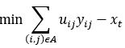
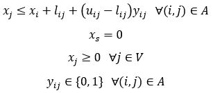
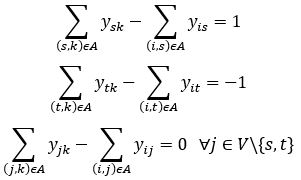
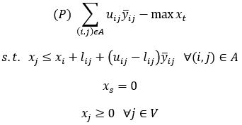
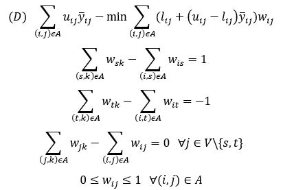
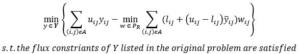
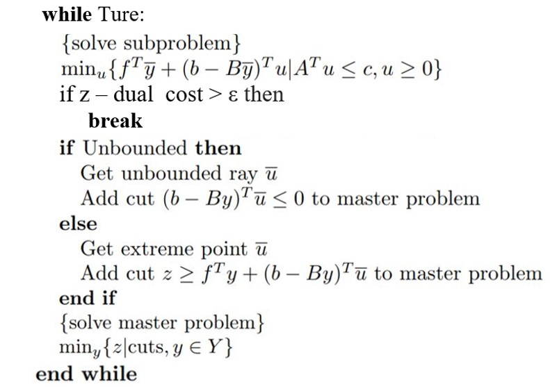
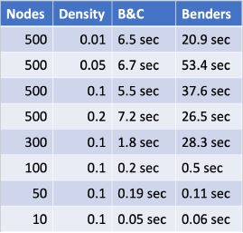

# Robust Shortest Path
Solve shortest path problems with uncertainty using Benders decomposition method

## 1. Problem Description
There are many sophisticated algorithms (e.x. Dijkstra, Bellman Ford Algorithm) to find shortest path in a weighted directed graph. Unfortunately, it is not a trivial task to exactly estimate the weights of the arcs; they are usually dependent on other factors (e.x. weather condition, traffic accidents) which are difficult to predict. Nevertheless, it is possible to specify a lower and upper bound for the cost of each arc.

The precise objective is to find a path *p* from source *s* to destination *t* on a weighted directed graph for which the difference between the length of the path *p* and the length of the shortest path from *s* to *t* in the graph is the smallest, subject to when the lengths of all arcs on the path *p* are at their upper bounds and the lengths of all other arcs are at their lower bounds.

## 2. Type of Formulation
Let (lij, uij) represent the lower and upper bound of arc(i, j).
Let yij = 1 if arc(i, j) is on path p, and yij = 0 otherwise. Therefore, when yij = 1, length of arc(i, j) = uij, and length of arc(i, j) = lij otherwise. Then, **Y** is the square matrix of size n that contains all yij, where n is the number of nodes in the graph.
Let xj represent the shortest distance from node *s* to *j* described under the scenario defined by **Y**.
Thus, the objective described in the Problem Description can be mathematically described as below:

     

Where xt represents the shortest distance between *s* and *t* under the scenario described by Y. The sum represents the length of path *p* under the circumstance that all arcs on path *p* are at their upper bounds.

## 3. Constraints
xj should be positive. yij should be a binary variable. xs = 0 because it is the starting node, the rest of the xj can be described recursively. If arc(i, j) is on path *p*, xj <= xi + uij, and xj <= xi + lij otherwise. Less than or equal to is used instead of strictly equal to because the shortest path to reach node j might not include node i. The list of constraints can be mathematically expressed as below:

     

There are a couple of additional constraints to be considered. The source node *s* should have +1 flux, the destination node *t* should have -1 flux, and all intermediate nodes should have 0 flux.

     

## 4. Benders Decomposition
Benders decomposition approach can be used to solve this mixed integer programming problem. The basic idea behind this approach is divide-and-conquer. The original problem is divided into two subproblems; in this case, the first subproblem involves only x and the second subproblem involves only y. The first subproblem is solved over x and the solution for the second subproblem is determined for a given solution of the first subproblem. 

If y is fixed at any **Y**, the original problem becomes a maximization problem with respect to xt.

     

If the above problem is dualized, the feasible region of the dual does not depend on the value of y, which only affects the objective function, as shown below. Also note that the dual problem is a classic shortest path problem on the variable w.

     

Let R represent the feasible region of the w and let PR represent a set of extreme points in region R. The original problem can be expressed as follows, and this formulation is referred to as the master problem for the rest of this report.

     

Initially, PR is an empty set. At each iteration, the subproblem (the dual) is solved, the PR is populated by including w if w is an extreme point, and a new cut is added to the master problem. The objective function value of the dual and the master problem corresponds to the upper and lower bound of the original problem; the optimal solution is found when they are equal.

The pseudocode below summarizes the Benders decomposition algorithm.

     

## 5. Results and Discussions
### 5.1 Graph Generation
The graph is represented by 2 square matrices (upper and lower bound of arc length) of size N. In this dataset, the ranges of the lower and upper bound are [1,9] and [21,29] respectively. Another parameter to adjust is the graph density, D. For each element in the 2 matrices, a random float number is generated between 0 and 1, if the value is < D, the element is set to a large number M, which indicates that this arc does not exist.

### 5.2 Performance on a Basic Weighted Directed Graph
We will start with a basic weighted directed graph to ensure that the algorithm works. See [video](https://www.youtube.com/watch?v=hICetc1Sds0) for my explanation on how Bender's decomposition method work on a toy example.

### 5.3 Implementation Simulation
[Here](https://github.com/martinzwm/robust-shortest-path/blob/master/robust_shortest_path.py) is the implementation in Python and [here](https://github.com/martinzwm/robust-shortest-path/blob/master/RSP.ipynb) is the comparison between Bender's Decomposition and Branch & Cut in [CPLEX](https://www.ibm.com/analytics/cplex-optimizer), which is a library of optimized algorithm used as mathematical programming solvers. The table below summarizes the result of running time.

     

Theoretically, Benders Decomposition should outperform Branch and Cut as the problem scales up and the graph is sparse. However, in this project, Branch and Cut seems to outperform Benders Decomposition. We suspect that this is due to the implementation of the Benders Decomposition for this paper may not be optimal as it was created by my team of university students and not optimized by experts as CPLEX has.

## 6. Next steps
There were several ideas that were not able to be implemented due to time constraint. As the recommendations of the next steps, one should investigate the performance of Benders decomposition with large dataset on GPU or cloud computing. Furthermore, since real road data would yield to very sparse graphs, it is more efficient to represent such graphs with adjacency lists instead of adjacency matrices. The corresponding complexities are O(V+E) and O(V2), where V is the number of nodes and E is the number of arcs. For sparse graphs, adjacency list is able to bring down the time complexity from quadratic to linear, which would scale significantly better as the number of node increases.

## Acknowledgement
This project is instructed by Professor [James Bookbinder](https://uwaterloo.ca/management-sciences/about/people/jbookbin). This report was written in partial fulfillment of the requirements for MSCI 435 (Advanced Optimization).

If you would like a copy of the report, [here](https://drive.google.com/file/d/1IRD3I72prNdJQE_aOCD04uA0D40w2Pzx/view?usp=sharing) is the link to download it.

I would like to especially thank my teammates [Mustafa Shahbaz](https://www.linkedin.com/in/mustafashahbaz/?originalSubdomain=ca) and Mark Qi for the hard work and late nights of brainstorming.